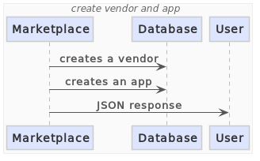

# C4 model

## System Architecture Diagrams

The c4-model library is used for generating system architecture
diagrams:

## Sequence Diagrams

The marketplace-examples project is an example of generating sequence
diagrams from code:

